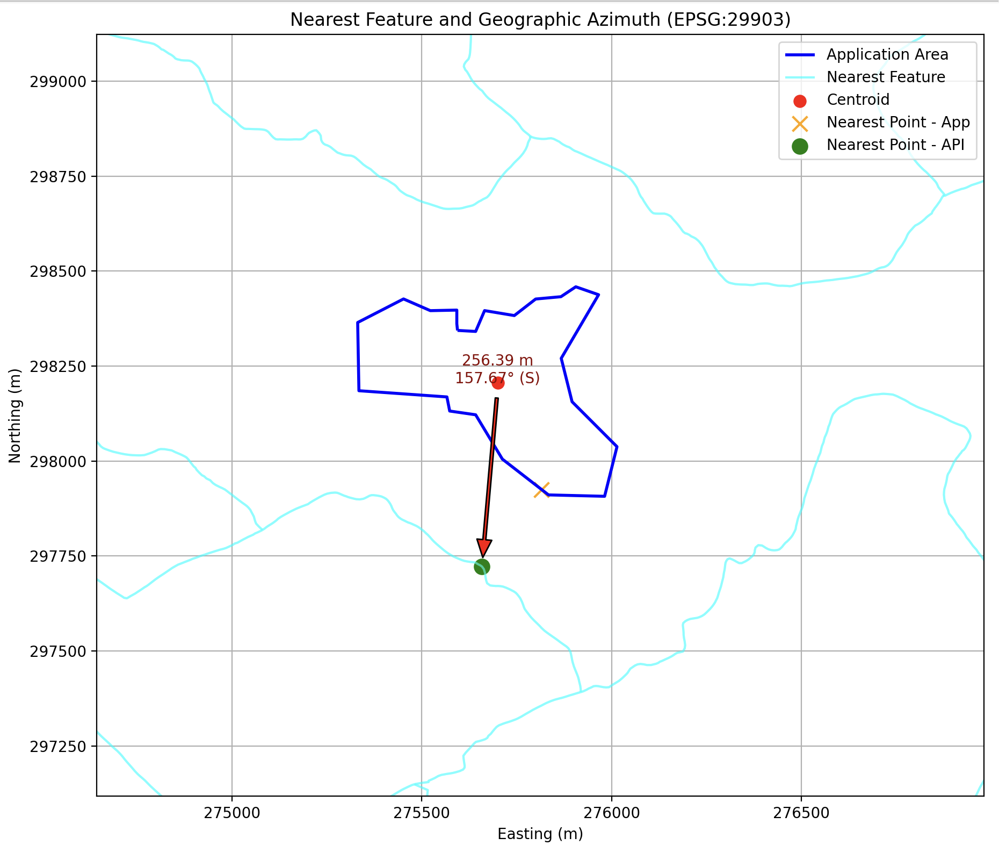

# Nearest Analysis QGIS Plugin

This plugin was developed to support environmental site assessments and regulatory mapping in Ireland, enabling reproducible geospatial workflows that automate proximity analysis between local project areas and national datasets (e.g., EPA WFS). This QGIS plugin performs nearest-feature analysis between a local "Application Area" and remote datasets (EPA WFS or ArcGIS Feature Service). It calculates the nearest distance and geographic azimuth (0° = North, clockwise)
and exports the nearest feature to CSV.

## Overview
The Nearest Analysis Plugin is not a single-function tool.
It integrates multiple geospatial processing components — including API-based data retrieval, coordinate transformation, proximity and azimuth computation, and automatic visualization and CSV export — into a single reproducible workflow for environmental site assessment.
The plugin was developed and tested over 5 months as part of an environmental protection project in Ireland.
It aims to provide a reusable and extensible framework for researchers and practitioners working with QGIS and national geospatial datasets (e.g., EPA WFS, ArcGIS REST services).
This modular design allows users to adapt the plugin for other datasets or research areas, ensuring transparency and reproducibility in geospatial analysis.

## Requirements
- QGIS with PyQt5
- geopandas, shapely, requests, owslib, matplotlib

## Installation
1. Download the repository from GitHub as a ZIP file, which will be automatically named nearest_analysis_plugin-main.zip.
2. Unzip it — inside the extracted folder nearest_analysis_plugin-main, you will find another folder named nearest_analysis_plugin.
3. Copy that inner folder (not the outer one) to your QGIS plugin directory and rename it to `nearest_analysis`:
   - **Windows:** `C:\Users\<username>\AppData\Roaming\QGIS\QGIS3\profiles\default\python\plugins\`
4. Restart QGIS, open the menu: Plugins → Manage and Install Plugins → Nearest_Analysis.
5. Enable the *Nearest Analysis* plugin.
   
## Usage
1. Load your shapefile (application area) into QGIS.
2. Choose an API layer (EPA or ArcGIS).
3. Run the analysis to generate a CSV and plot.

## Minimal Reproducible Example

To ensure reproducibility without dependency on live API services, 
this repository includes a minimal example dataset located in:

example_data/

Contents:

- input_polygons.gpkg  
  Sample application area used for testing.

- api_snapshot.geojson  
  Static snapshot of the EPA WFD River Waterbodies dataset 
  clipped to a small study area.

### Reproducing the Workflow

1. Load `input_polygons.gpkg` into QGIS.
2. Load `api_snapshot.geojson`.
3. Run the Nearest Analysis plugin.
4. Export the resulting CSV.

This allows the workflow to be reproduced without network access.

## Example Output

After running the plugin in QGIS, the analysis generates both a map and a CSV file.  
Below is a small example of the CSV output generated by the tool:

| Nearest_Feature | Distance_m | Direction (°) | Direction |
|-----------------|-------------|--------------|------------|
| River | 1530.45 | 45.0 | NE |
| Building | 2875.32 | 180.0 | S |
| Forest | 964.22 | 270.0 | W |

The plugin also produces a visualization showing the application area (blue)  
and nearest features (red) with connecting arrows:

## License
This project is licensed under the MIT License – see [LICENSE](./LICENSE) for details.

## Citation

If you use this software in your research, please cite:

chao515737. (2026). *Nearest Analysis QGIS Plugin*. Zenodo.  
https://doi.org/10.5281/zenodo.18262401
