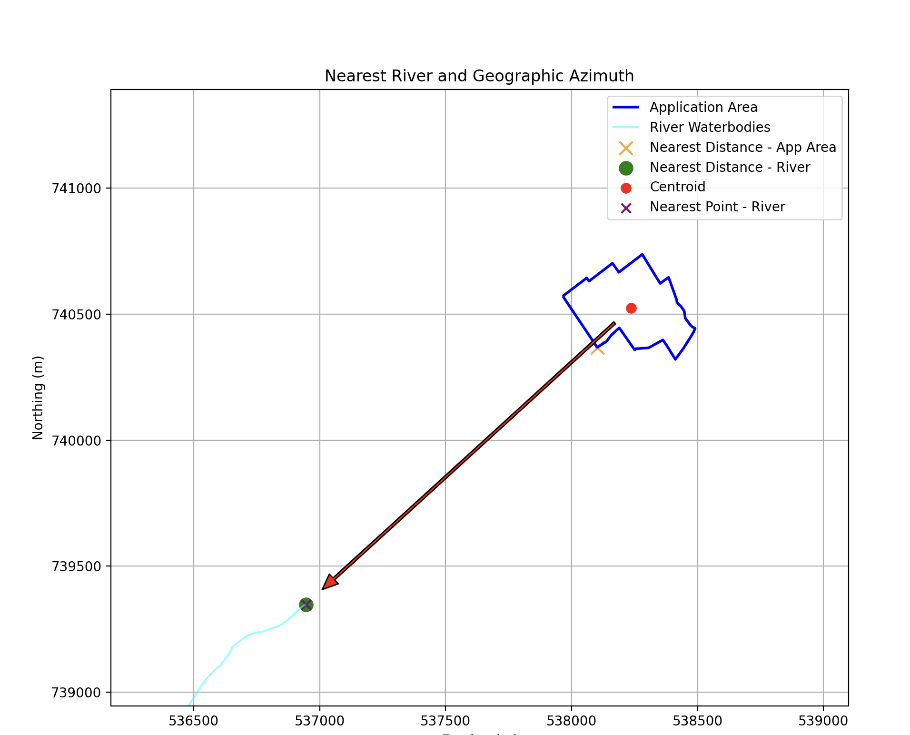

# nearest_analysis_plugin# Nearest Analysis QGIS Plugin

This QGIS plugin performs nearest-feature analysis between a local "Application Area"
and remote datasets (EPA WFS or ArcGIS Feature Service).  
It calculates the nearest distance and geographic azimuth (0° = North, clockwise)
and exports the nearest feature to CSV.

## Requirements
- QGIS with PyQt5
- geopandas, shapely, requests, owslib, matplotlib

## Usage
1. Load your shapefile (application area) into QGIS.
2. Choose an API layer (EPA or ArcGIS).
3. Run the analysis to generate a CSV and plot.

## Example Output

After running the plugin in QGIS, the analysis generates both a map and a CSV file.  
Below is a small example of the CSV output generated by the tool:

| Nearest_Feature | Distance_m | Direction (°) | Direction |
|-----------------|-------------|--------------|------------|
| River | 1530.45 | 45.0 | NE |
| Building | 2875.32 | 180.0 | S |
| Forest | 964.22 | 270.0 | W |

The plugin also produces a visualization showing the application area (blue)  
and nearest features (red) with connecting arrows:

## License
This project is licensed under the MIT License – see [LICENSE](./LICENSE) for details.
